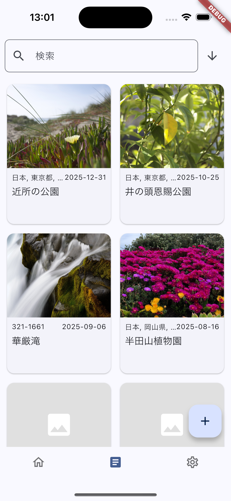
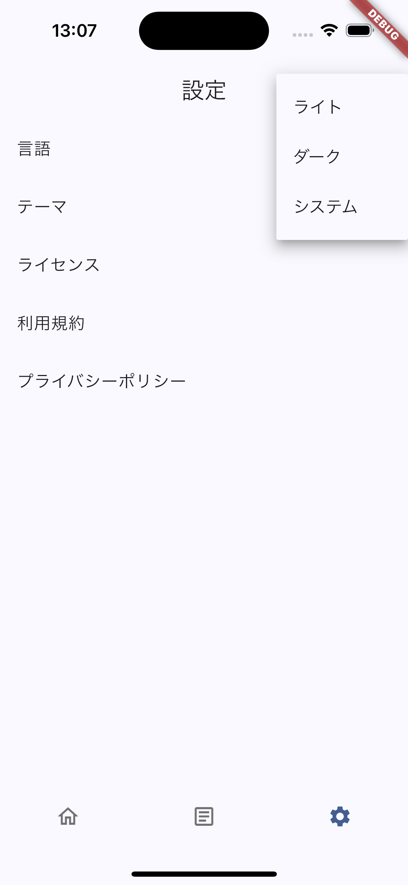
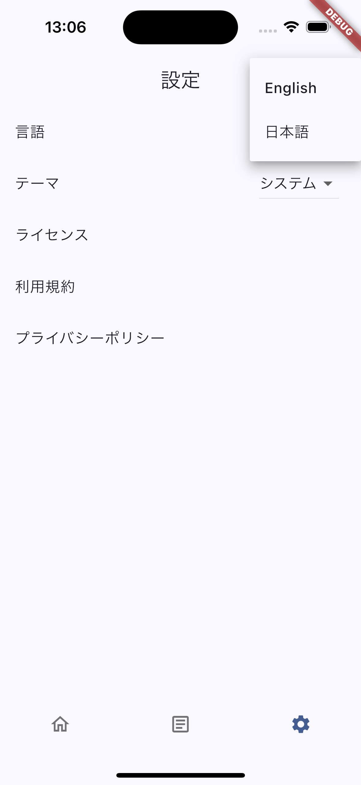

# Molavel

## はじめに

Molavelは、旅行やスポーツなどのアクティビティを記録するアプリケーションです。

## 利用手順

### 1. アプリケーションの起動と初期設定

1. デバイスにインストールされたアプリケーションのアイコンをタップして起動します。
2. 初回起動時に、テーマ（ライトモード/ダークモード/システム設定）がOSの設定に基づいて適用されます。
3. 言語設定は、デバイスの言語設定に基づいて自動的に設定されます（日本語または英語）。

### 2. ホーム画面

アプリケーションを起動するとホーム画面が表示されます。ここがすべての操作の起点となります。

### 3. アクティビティ追加

1. ホーム画面の「＋」ボタンをタップして新しいアクティビティを追加します。

2. アクティビティの詳細を入力し画面右上の登録ボタンを押下します。

### 4. アクティビティ一覧

1. ボトムナビゲーションメニューのアクティビティ一覧から、追加したアクティビティを確認できます。  
検索機能や、検索ボックスの右側の矢印アイコンを押下することでアクティビティを開始日時の昇順または降順に並び替えをすることが可能です。

### 5. テーマの変更

アプリケーションの表示テーマ（ライトモード/ダークモード）を切り替えることができます。

1. 設定画面に移動します。

2. テーマ設定のオプションをタップします。

3. 「ライト」「ダーク」「システム設定」から希望のテーマを選択します。選択は即座に反映され、以降のアプリケーション起動時にも維持されます。

### 6. 言語の変更

表示言語を日本語と英語で切り替えることができます。

1. 設定画面に移動します。

2. 言語設定のオプションをタップします。

3. 「日本語」または「English」を選択します。選択後、アプリケーションの表示言語が即座に切り替わります。この設定は次回以降も保持されます。

